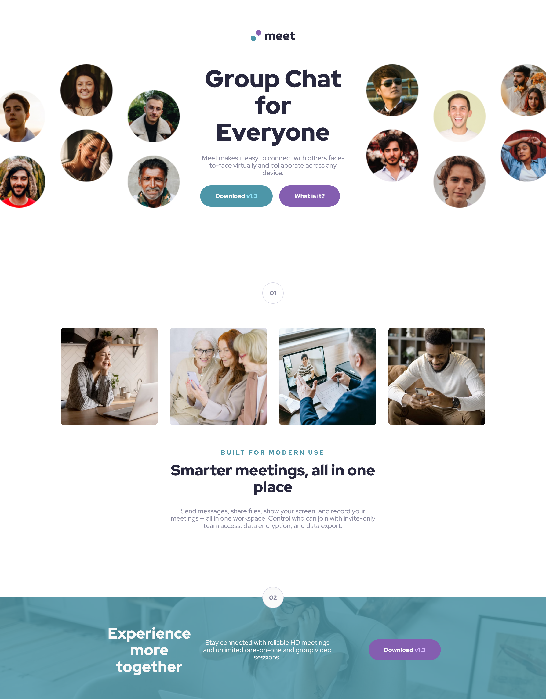
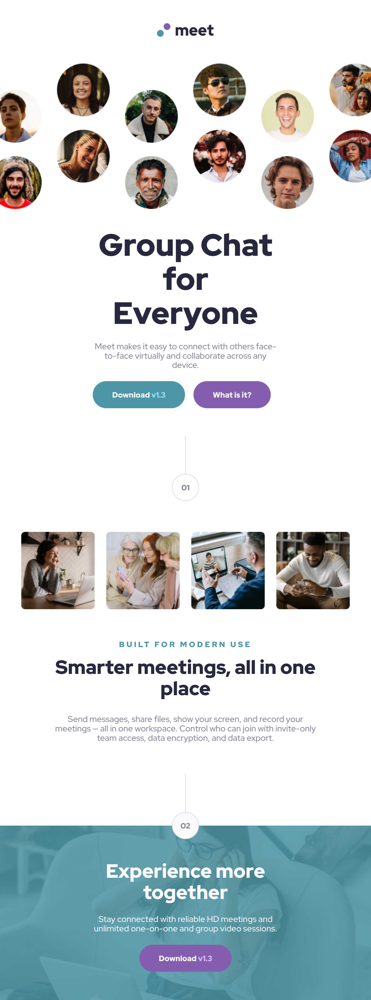
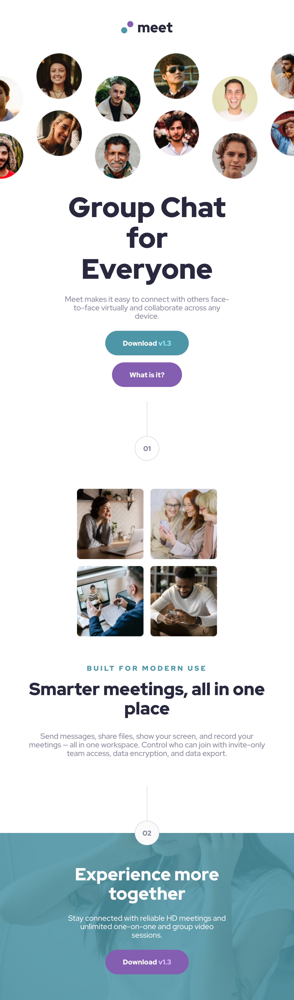

# Frontend Mentor - Meet landing page solution

This is a solution to the [Meet landing page challenge on Frontend Mentor](https://www.frontendmentor.io/challenges/meet-landing-page-rbTDS6OUR). 

### Design screenshots

#### Desktop 🖥️

#### Tablet 💻

#### Mobile 📱

### Links

- Solution URL: [GitHub](https://github.com/JuliAlchemDev/FM-meet-landing-page)
- Live Site URL: [GitHub Pages](https://julialchemdev.github.io/FM-meet-landing-page/)

## My process

1. **Initial setup**
   - Started the project by removing starter code and configuring the project structure (`header`, `main`, `footer`).
   - Added `.gitignore` and removed unnecessary files like `.vscode` and `node_modules`.
   - Connected base stylesheets and configured **Sass (SCSS)** for modular styling.

2. **HTML structure and semantic improvements**
   - Separated content into `header`, `main`, and `footer`.
   - Added semantic tags (`<article>`, `<section>`) and descriptive `alt` attributes for images.
   - Applied **BEM methodology** to ensure consistent class naming.

3. **Header development**
   - Added logo and hero images with responsive scaling.
   - Styled header text, buttons, and layout across mobile, tablet, and desktop.
   - Ensured typography consistency using Red Hat Display fonts.

4. **Main section development**
   - Created article wrappers for text content.
   - Set up responsive layouts for `main__collage` using `<picture>` and `<source>` elements for image optimization.
   - Applied typography, colors, and spacing tokens via CSS custom properties.

5. **Footer development**
   - Wrapped footer content in semantic tags and articles.
   - Added background image with overlay, section separator, and spacing adjustments.
   - Completed desktop layout styling and simplified CSS for maintainability.

6. **Refactoring, maintenance, and optimizations**
   - Modularized SCSS by separating component styles and connecting them in `main.scss`.
   - Simplified class names, created utility classes, and cleaned up unused images.
   - Applied **Prettier** to organize code structure.
   - Fixed issues with layout and re-added `main.css` for GitHub Pages deployment.

### What I learned
The development of this project reinforced several key front-end principles and techniques:

- **Modular and maintainable styling**: Structured CSS using Sass (SCSS) with a focus on component-based styles, all connected via a central `main.scss`.
- **BEM methodology**: Applied consistent class naming to keep styles organized and maintainable.
- **Mobile-first responsive layout**: Built layouts using CSS Grid to ensure responsiveness across mobile, tablet, and desktop devices.
- **Semantic and accessible markup**: Used semantic HTML5 tags and attributes to improve accessibility and provide a robust foundation for assistive technologies.
- **Implementing design tokens**: Leveraged CSS custom properties for colors and typography to create a flexible, easily updatable design system.
- **Image optimization for responsiveness**: Used `<picture>` and `<source>` elements to serve scaled and optimized images for different screen sizes.
- **Git workflow**: Practiced meaningful commits, branch management, and collaborative version control.

### Built with

- **HTML5** (Semantic tags: `<header>`, `<main>`, `<footer>`, `<article>`, `<section>`)
- **CSS3 & Sass** (Nested styles, variables, partials)
- **CSS Grid** for layout
- **Mobile-first workflow**
- **BEM methodology** for class naming
- **Responsive design** across mobile, tablet, and desktop
- **Git** for version control
- **GitHub** for PR and deploy
- **Figma** for design reference

## Author

- Linkedin - [Julia Alkhimova](https://www.linkedin.com/in/julialkhimova/)
- Frontend Mentor - [@JuliAlchemDev](https://www.frontendmentor.io/profile/JuliAlchemDev)